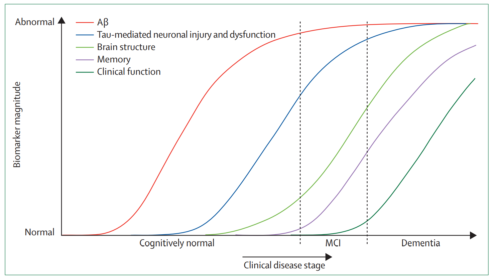
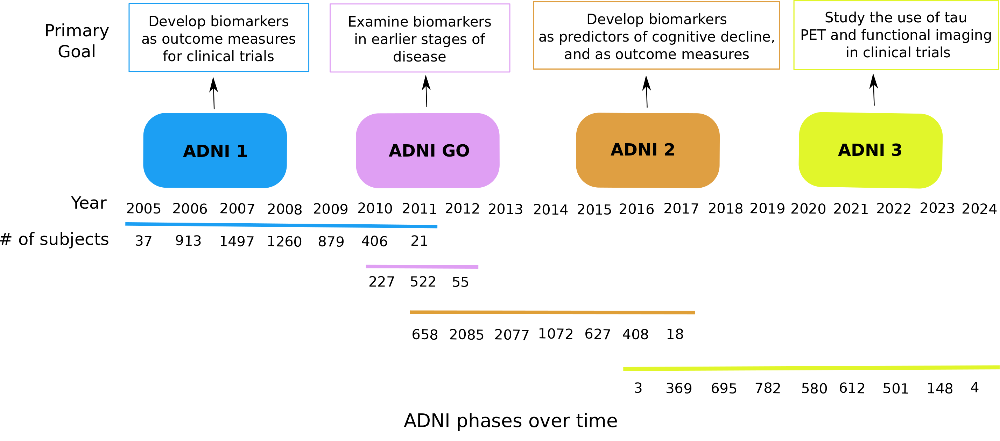
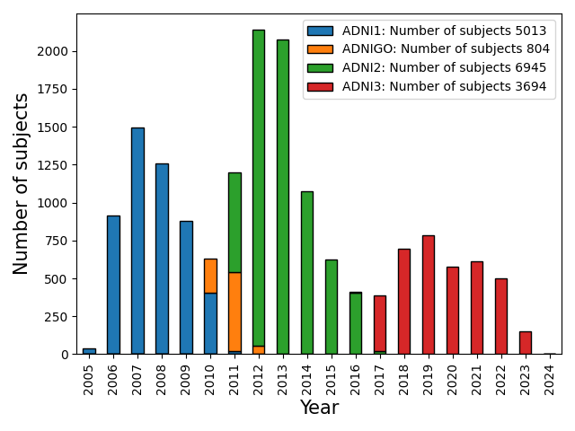

# Alzheimer's project

[Link to the Alzheimer's Disease Neuroimaging Initiative (ADNI) website from where you can access the data](https://adni.loni.usc.edu/).

# Introduction
--------------

Alzheimer's disease (AD) is a neurodegenerative disorder causing devastating changes in the brain
and cognition, if not intervened.
While the symptoms may be minimal at the early stages of AD e.g., Mild Cognitive Impairment (MCI),
but as the disease progress the symptoms will get worse in return affect daily life activities.
The rate at which the disease progresses varies between
individuals. While there is no effective cure till now, but medicines can delay the progress.
Therefore, the central goal of the ADNI is to get a better understanding of the AD pathological
pathway via developing biomarkers for the improvement of clinical trials.

AD can be detected by the presence of the abnormal protein deposits in the brain
known as amyloid-Beta plaques and tau tangles associated with synapse loss and neurodegenration.
Currently, the detection of conventional AD biomarkers
require expensive and invasive diagnostic tools such as Positron Emission Tomography (PET),
Magnetic Resonance Imaging (MRI), and Cerebro Spinal Fluid (CSF) sampling.

Schematic outline of the current understanding of the hypothetical timeline for the onset
and progression of AD neurodegeneration and cognitive impairments
[Michael W. Weiner et al. Alz. Dement. (2017)](https://alz-journals.onlinelibrary.wiley.com/doi/10.1016/j.jalz.2016.11.007)




## Contents
-----------

## Background
-------------



## Data description
-------------------



## Header 2
> This is a blockquote following a header.
>
> When something is important enough, you do it even if the odds are not in your favor.

### Header 3

```js
// Javascript code with syntax highlighting.
var fun = function lang(l) {
  dateformat.i18n = require('./lang/' + l)
  return true;
}
```

```ruby
# Ruby code with syntax highlighting
GitHubPages::Dependencies.gems.each do |gem, version|
  s.add_dependency(gem, "= #{version}")
end
```

#### Header 4

*   This is an unordered list following a header.
*   This is an unordered list following a header.
*   This is an unordered list following a header.

##### Header 5

1.  This is an ordered list following a header.
2.  This is an ordered list following a header.
3.  This is an ordered list following a header.

###### Header 6

| head1        | head two          | three |
|:-------------|:------------------|:------|
| ok           | good swedish fish | nice  |
| out of stock | good and plenty   | nice  |
| ok           | good `oreos`      | hmm   |
| ok           | good `zoute` drop | yumm  |

### There's a horizontal rule below this.

* * *

### Here is an unordered list:

*   Item foo
*   Item bar
*   Item baz
*   Item zip

### And an ordered list:

1.  Item one
1.  Item two
1.  Item three
1.  Item four

### And a nested list:

- level 1 item
  - level 2 item
  - level 2 item
    - level 3 item
    - level 3 item
- level 1 item
  - level 2 item
  - level 2 item
  - level 2 item
- level 1 item
  - level 2 item
  - level 2 item
- level 1 item

### Small image


### Large image


### Definition lists can be used with HTML syntax.

<dl>
<dt>Name</dt>
<dd>Godzilla</dd>
<dt>Born</dt>
<dd>1952</dd>
<dt>Birthplace</dt>
<dd>Japan</dd>
<dt>Color</dt>
<dd>Green</dd>
</dl>

```
Long, single-line code blocks should not wrap. They should horizontally scroll if they are too long. This line should be long enough to demonstrate this.
```

```
The final element.
```
